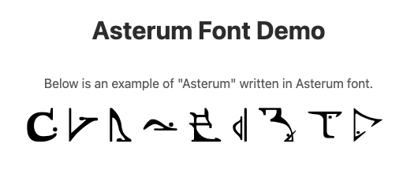

# Asterum Font

This font was created to introduce the Asterum language to the people of Earth. This font was specifically created for the [Asterum Input](https://github.com/yumenohosi/asterum-input) project, a text converter between Korean and Asterum language.

## Features
- Modern and distinctive design
- Optimized for web projects
- Comprehensive icon set collection

## Installation

### Using CDN
Add the following line to your HTML file:
```html
<link rel="stylesheet" href="https://cdn.jsdelivr.net/gh/yumenohosi/asterum-font@main/style.css">
```

Or import in your CSS file:
```css
@import url('https://cdn.jsdelivr.net/gh/yumenohosi/asterum-font@main/style.css');
```

### For Web Projects
1. Include the `style.css` file in your project
2. Copy the font files from the `fonts` directory to your project

### For Desktop Applications
- Install the TTF font file from the `fonts` directory

## Usage
- Open `demo.html` to see all available glyphs and their corresponding codes



## Project Structure
```
asterum-font/
├── fonts/         # Font files
├── demo/          # Demo-related image file
├── demo.html      # Font preview and usage guide
├── selection.json # IcoMoon project file
└── style.css      # Stylesheet for web usage
```

## License
This project is licensed under the Apache License 2.0 - see the [LICENSE](LICENSE) file for details.


## Author
[Park Daesun](https://github.com/yumenohosi)

## Questions and Issues
If you have any questions or issues, please create an issue in the GitHub repository. 